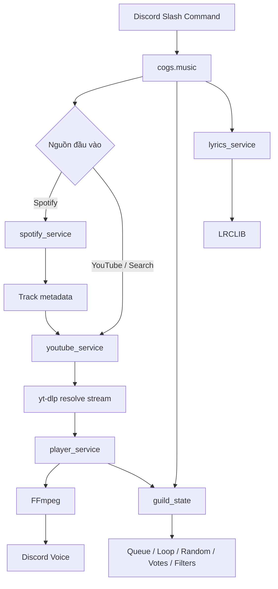

# 🎵 Discord Music Bot

Discord Music Bot viết bằng **Python + discord.py**, tập trung vào phát nhạc từ **YouTube** và **Spotify**, quản lý hàng đợi theo từng server (Guild), điều khiển bằng **Slash Commands**, cùng các cơ chế tối ưu cho việc resolve stream, xử lý lỗi và quản lý vòng đời FFmpeg.

> README này được tổng hợp trực tiếp từ cấu trúc và mã nguồn hiện tại của dự án trong `musicbot.md`. Một số điểm được ghi rõ là **lưu ý/điểm cần kiểm tra** khi triển khai vì mã nguồn hiện tại vẫn còn một vài chỗ chưa đồng nhất.

---

## ✨ Tính năng chính

### Playback & Queue

- Phát bài hát từ tên bài, URL YouTube hoặc URL Spotify.
- Hỗ trợ thêm **track / album / playlist Spotify** vào queue.
- Queue độc lập theo từng Discord Guild.
- `/queue` có giao diện phân trang, **10 bài/trang** và nút điều hướng.
- `/search` cho phép chọn chính xác một trong **5 kết quả YouTube**.
- `/skip`, `/skipto`, `/shuffle`.
- Chế độ phát tuần tự hoặc phát ngẫu nhiên.
- Lặp bài hiện tại.
- `/pause`, `/resume`, `/stop`, `/leave`.
- `/nowplaying` hiển thị bài đang phát, thumbnail và thông tin thời lượng.

### Spotify → YouTube matching

Spotify trong dự án được dùng để lấy **metadata** của bài hát; audio được resolve sang nguồn phát thực tế thông qua YouTube.

Cơ chế matching hiện tại:

1. Lấy metadata Spotify bằng anonymous web token.
2. Tìm tối đa 5 ứng viên YouTube.
3. Ưu tiên truy vấn `official audio`.
4. Chấm điểm ứng viên theo title, artist, uploader và duration.
5. Trừ mạnh các biến thể như `remix`, `lofi`, `slowed`, `cover`, `live`, `karaoke`, `mashup`, `instrumental`... khi metadata Spotify không yêu cầu.
6. Ưu tiên kênh `Topic`, kênh trùng nghệ sĩ và video có nhãn `Official`.
7. Cache kết quả matching theo URL Spotify.

### Audio pipeline

- `yt-dlp` chịu trách nhiệm trích xuất metadata và stream URL.
- Các tác vụ `yt-dlp` blocking được chạy qua executor và giới hạn đồng thời bằng `asyncio.Semaphore`.
- Có fallback giữa các `player_client` của YouTube.
- Có tùy chọn fallback sang SoundCloud.
- FFmpeg dùng reconnect và timeout cho stream.
- Có lớp `GracefulFFmpegPCMAudio` để cố gắng `SIGTERM` trước khi buộc `SIGKILL` và đóng pipe/process để hạn chế process zombie và file-descriptor leak.

### Audio filters

Có các preset filter trong `core/config.py`:

- `none`
- `bassboost`
- `nightcore`
- `8d`
- `slowedreverb`
- `vaporwave`

### Lyrics

- Tích hợp **LRCLIB**.
- Không yêu cầu API key theo mã nguồn hiện tại.
- Hỗ trợ lời tĩnh (`plainLyrics`) và lời đồng bộ (`syncedLyrics`).
- Parser LRC chuyển timestamp về số giây để có thể dùng cho tính năng đồng bộ về sau.

### Voice lifecycle

- Khi không còn người thật trong voice channel, bot bắt đầu countdown tự động rời phòng.
- Nếu có người quay lại trước khi hết thời gian, countdown được hủy.
- State của Guild được dọn sau khi bot disconnect.

### Permissions & skip voting

- Admin / người có `Manage Server` hoặc member có **DJ role** được quyền skip trực tiếp.
- Người dùng thường sử dụng cơ chế vote skip.
- Ngưỡng hiện tại: **hơn một nửa số người thật trong voice channel** (`floor(n/2) + 1`).
- `/setdj` yêu cầu quyền `Manage Server`.

---

## 🧩 Kiến trúc dự án

Dự án đã tách khỏi mô hình `bot.py` monolithic thành các lớp **Cogs → Services → Models → Core**.

```text
.
├── cogs/
│   ├── __init__.py
│   ├── music.py
│   ├── queue_view.py
│   └── voice_events.py
│
├── core/
│   ├── __init__.py
│   ├── config.py
│   ├── errors.py
│   └── logger.py
│
├── models/
│   ├── __init__.py
│   ├── guild_state.py
│   └── track.py
│
├── services/
│   ├── __init__.py
│   ├── audio_service.py
│   ├── lyrics_service.py
│   ├── player_service.py
│   ├── spotify_service.py
│   └── youtube_service.py
│
├── bot.py
└── main.py
```

### Vai trò từng layer

| Layer | Thành phần | Trách nhiệm |
|---|---|---|
| **Cogs** | `music.py` | Slash commands và luồng tương tác Discord |
| | `queue_view.py` | Pagination queue và search select UI |
| | `voice_events.py` | Theo dõi voice state và auto-disconnect |
| **Services** | `player_service.py` | Điều phối playback, queue transition, watchdog và generation |
| | `youtube_service.py` | `yt-dlp`, tìm kiếm, matching và resolve stream |
| | `spotify_service.py` | Parse URL, anonymous token, lấy metadata Spotify |
| | `lyrics_service.py` | Lấy và parse lyrics từ LRCLIB |
| | `audio_service.py` | Wrapper cho lifecycle của FFmpeg |
| **Models** | `track.py` | Domain model của bài hát |
| | `guild_state.py` | State machine và state per Guild |
| **Core** | `config.py` | Environment/config dùng chung |
| | `errors.py` | Global App Command error handler |
| | `logger.py` | Logging tập trung |
| **Entry point** | `main.py` | Khởi tạo bot, load cogs, sync commands, health server |

---

## 🔄 Luồng xử lý tổng quát



---

## 🎮 Slash Commands

| Command | Mô tả |
|---|---|
| `/play <query>` | Phát hoặc thêm bài từ tên bài / YouTube / Spotify |
| `/search <query>` | Tìm và chọn một trong 5 kết quả YouTube |
| `/pause` | Tạm dừng |
| `/resume` | Tiếp tục |
| `/skip` | Bỏ qua bài; vote nếu không phải DJ/Admin |
| `/skipto <index>` | Nhảy tới bài thứ `index` trong queue |
| `/shuffle` | Xáo trộn queue |
| `/randommode` | Bật/tắt phát ngẫu nhiên |
| `/loopmode` | Bật/tắt lặp bài hiện tại |
| `/queue` | Hiển thị queue có phân trang |
| `/nowplaying` | Hiển thị bài hiện tại |
| `/filter <name>` | Chọn audio filter |
| `/lyrics` | Hiển thị lyrics |
| `/stop` | Dừng và xóa queue |
| `/leave` | Rời voice và xóa state |
| `/setdj <role>` | Đặt DJ role; yêu cầu `Manage Server` |

### Gợi ý sử dụng

```text
/play Never Gonna Give You Up
/play https://www.youtube.com/watch?v=...
/play https://open.spotify.com/track/...
/play https://open.spotify.com/album/...
/play https://open.spotify.com/playlist/...

/search faded
/queue
/nowplaying
/pause
/resume
/skip
/skipto 3
/shuffle
/randommode
/loopmode
/filter bassboost
/lyrics
/stop
/leave
```

> Các alias prefix command như `!play`, `!skip`, `!queue`... tồn tại trong `bot.py` legacy. Luồng khởi chạy hiện tại trong `main.py` dùng Slash Commands và load `cogs.music` + `cogs.voice_events`.

---

## ⚙️ Cấu hình môi trường

`core/config.py` đọc cấu hình từ `.env`.

### Biến môi trường chính

| Biến | Bắt buộc | Mặc định | Ý nghĩa |
|---|---:|---|---|
| `DISCORD_TOKEN` | ✅ | — | Token bot Discord |
| `DEV_GUILD_ID` | ❌ | — | Guild dùng để sync slash command dev nhanh hơn |
| `DENO_PATH` | ❌ | `shutil.which("deno")` | Đường dẫn Deno cho yt-dlp |
| `YTDLP_COOKIES_FILE` | ❌ | — | File cookies cho yt-dlp |
| `POT_PROVIDER_URL` | ❌ | — | Địa chỉ provider cho YouTube PO Token |
| `ENABLE_SOUNDCLOUD_FALLBACK` | ❌ | `true` | Bật fallback sang SoundCloud |
| `AUTO_DISCONNECT_SECONDS` | ❌ | `60` | Thời gian chờ khi voice channel không còn người |
| `PREFETCH_LEAD_SECONDS` | ❌ | `18` | Ngưỡng lead time cho prefetch (được khai báo trong config) |
| `FFMPEG_TERMINATE_TIMEOUT` | ❌ | `2.0` | Thời gian chờ SIGTERM trước SIGKILL |
| `SPOTIFY_CLIENT_ID` | ❌ | rỗng | Biến cấu hình Spotify; code resolver hiện tại dùng anonymous token |
| `SPOTIFY_CLIENT_SECRET` | ❌ | rỗng | Biến cấu hình Spotify; code resolver hiện tại không dùng trong luồng anonymous token |
| `SPOTIFY_MARKET` | ❌ | `VN` | Market Spotify |
| `SPOTIFY_MAX_TRACKS_PER_REQUEST` | ❌ | `100` | Kích thước request track Spotify |
| `SPOTIFY_QUEUE_LIMIT` | ❌ | `500` | Giới hạn track Spotify được đưa vào queue |
| `PORT` | ❌ | `8080` | Port cho health-check web server |

### Ví dụ `.env`

```env
DISCORD_TOKEN=your_discord_bot_token
DEV_GUILD_ID=123456789012345678

# Tuỳ chọn cho yt-dlp / YouTube
DENO_PATH=C:\path\to\deno.exe
YTDLP_COOKIES_FILE=C:\path\to\cookies.txt
POT_PROVIDER_URL=http://127.0.0.1:4416
ENABLE_SOUNDCLOUD_FALLBACK=true

# Voice lifecycle
AUTO_DISCONNECT_SECONDS=60
PREFETCH_LEAD_SECONDS=18

# Spotify
SPOTIFY_MARKET=VN
SPOTIFY_QUEUE_LIMIT=500
SPOTIFY_MAX_TRACKS_PER_REQUEST=100

# Deployment / health check
PORT=8080
```

> Không commit `.env`, token Discord hoặc cookies vào repository.

---

## 🛠️ Yêu cầu hệ thống

Các yêu cầu được suy ra trực tiếp từ import và cách mã nguồn tạo audio process:

- **Python 3.10+** (mã nguồn sử dụng syntax union type như `str | None`).
- `discord.py` có hỗ trợ `discord.app_commands` và voice.
- `yt-dlp`.
- `aiohttp`.
- `python-dotenv`.
- **FFmpeg** phải có sẵn trong môi trường chạy bot.
- **Deno** là thành phần tùy chọn nhưng được hỗ trợ để yt-dlp chạy JavaScript runtime khi cần.
- Bot Discord cần quyền tham gia voice và gửi message/embed trong các channel tương ứng.

---

## 🚀 Cài đặt

### 1. Clone project

```bash
git clone <your-repository-url>
cd <project-directory>
```

### 2. Tạo virtual environment

Windows:

```powershell
py -3.11 -m venv .venv
.\.venv\Scripts\Activate.ps1
```

Linux/macOS:

```bash
python3 -m venv .venv
source .venv/bin/activate
```

### 3. Cài dependency Python

Do file dependency chưa được thể hiện trong nguồn được phân tích, tối thiểu cần cài các package mà project import:

```bash
pip install -U discord.py yt-dlp aiohttp python-dotenv
```

### 4. Cài FFmpeg

Đảm bảo lệnh sau chạy được:

```bash
ffmpeg -version
```

FFmpeg phải nằm trong `PATH` hoặc được cấu hình theo môi trường triển khai.

### 5. Cấu hình `.env`

Tạo `.env` ở thư mục gốc và điền `DISCORD_TOKEN`.

### 6. Chạy bot

Entry point hiện tại:

```bash
python main.py
```

---

## 🌐 Health check / deployment

`main.py` dựng một HTTP server bằng `aiohttp` để nền tảng hosting có thể kiểm tra process.

### Root

```http
GET /
```

Trả về:

```text
Bot is running!
```

### Health

```http
GET /health
```

Trả về:

```text
OK
```

Port lấy từ `PORT`, mặc định `8080`.

---

## 🧠 Guild State & chống race-condition

`models/guild_state.py` là trung tâm lưu trạng thái playback theo từng Guild.

### Player state

```text
IDLE
  ↓
RESOLVING
  ↓
PLAYING ↔ PAUSED
  ↓
STOPPING / ERROR
```

Ngoài queue/current track, state còn lưu:

- `loop`
- `random_mode`
- `active_filter`
- `filter_reapply`
- `text_channel_id`
- `dj_role_id`
- `skip_votes`
- prefetch task
- auto-disconnect task
- `asyncio.Lock`
- `playback_generation`

### Playback generation

Mỗi lần bắt đầu một lượt playback mới, generation được tăng. Nếu người dùng `/skip` hoặc `/stop` trong lúc `yt-dlp` còn đang resolve, task cũ bị nhận diện là stale và không được phép tiếp tục phát nhầm stream.

Đây là một trong các cơ chế quan trọng để giảm race-condition giữa:

```text
resolve stream
     ↕
skip / stop / shuffle / mode change
     ↕
after-callback
```

---

## 🔊 YouTube & stream resolution

`services/youtube_service.py` sử dụng `yt-dlp` theo hai nhóm cấu hình:

### Flat extraction

Dùng để lấy metadata / danh sách mà chưa cần resolve stream audio thực tế.

```python
extract_flat = "in_playlist"
```

### Stream extraction

Dùng để lấy URL audio thật cho FFmpeg:

```python
noplaylist = True
format = "bestaudio/best"
```

### Fallback player clients

Chuỗi hiện tại:

```text
1. android + ios
2. tv_embedded
```

Nếu YouTube không resolve được và `ENABLE_SOUNDCLOUD_FALLBACK=true`, bot thử query SoundCloud.

---

## 🎚️ FFmpeg & audio filters

`core/config.py` định nghĩa các option mặc định:

```text
-reconnect 1
-reconnect_streamed 1
-reconnect_delay_max 5
-analyzeduration 0
-probesize 32k
```

Một số luồng playback trong `player_service.py` còn dùng:

```text
-rw_timeout 10000000
-nostdin
```

Audio filter được thêm bằng `-af`.

Ví dụ:

```text
-af "equalizer=f=60:width_type=h:width=50:g=12"
```

---

## 🎼 Spotify resolver

`services/spotify_service.py` nhận diện:

```text
https://open.spotify.com/track/...
https://open.spotify.com/album/...
https://open.spotify.com/playlist/...
spotify:track:...
spotify:album:...
spotify:playlist:...
```

Luồng xử lý sử dụng endpoint web của Spotify để lấy **anonymous access token**, sau đó gọi Spotify Web API với token đó.

Spotify collection có cơ chế phân trang playlist và áp dụng `SPOTIFY_QUEUE_LIMIT` để tránh queue tăng không kiểm soát.

---

## 📜 Lyrics

`services/lyrics_service.py` gọi:

```text
GET https://lrclib.net/api/get
GET https://lrclib.net/api/search
```

Nếu endpoint chính trả `404`, service chuyển sang search fallback.

LRC timestamp được parse về dạng:

```python
LyricLine(
    timestamp=<seconds>,
    text=<line>
)
```

Từ đó `lyrics` command có thể hiển thị plain lyrics hoặc dựng text từ synced lyrics nếu chỉ có bản đồng bộ.

---

## 🔐 Quyền Discord cần lưu ý

Bot cần tối thiểu các quyền phù hợp với cách dùng của project, đặc biệt:

- View Channels
- Send Messages
- Embed Links
- Connect
- Speak
- Use Voice Activity

`/setdj` yêu cầu `Manage Server`.

Trong `main.py`, intents được bật cho:

```python
intents.voice_states = True
intents.guilds = True
```

`bot.py` legacy bật thêm `message_content` và `members`, nhưng đó không phải entry point mới.

---

## 🗂️ Legacy vs. current implementation

### `main.py` — implementation hiện tại

Đây là entry point mới, chịu trách nhiệm:

- tạo `MusicBot`;
- load `cogs.music`;
- load `cogs.voice_events`;
- khởi tạo `PlayerService`;
- gắn global App Command error handler;
- sync Slash Commands;
- mở HTTP health-check server;
- gọi `bot.start(config.TOKEN)`.

### `bot.py` — legacy implementation

`bot.py` vẫn chứa phiên bản cũ dựa trên prefix commands (`!play`, `!skip`, ...) cùng một `GuildMusicState` đơn giản hơn.

Khi triển khai theo kiến trúc mới, nên coi `main.py` là entry point chính và tránh chạy đồng thời hai implementation.

---

## ⚠️ Các điểm cần kiểm tra trước khi production

Phần này được ghi lại vì có những tham chiếu giữa các module trong nguồn hiện tại chưa hoàn toàn khớp nhau.

### 1. `fetch_playlist_chunk` chưa thấy trong `SpotifyService`

`cogs/music.py` gọi:

```python
spotify_service.fetch_playlist_chunk(...)
```

trong `_expand_spotify_playlist_bg`, nhưng `services/spotify_service.py` hiện tại không định nghĩa method này trong nội dung được cung cấp.

Nếu nhánh background expansion được gọi, đây là điểm cần bổ sung/đồng bộ trước khi production.

### 2. Tên config auto-disconnect chưa đồng nhất

`core/config.py` khai báo:

```python
AUTO_DISCONNECT_SECONDS
```

trong khi `services/player_service.py` dùng:

```python
config.AUTO_DISCONNECT_DELAY
```

Hai tên này không đồng nhất và có thể gây `AttributeError` ở path auto-disconnect do queue rỗng. Cần thống nhất thành một biến cấu hình.

### 3. `audio_service.py` và `player_service.py` chưa được nối hoàn toàn

Project có `GracefulFFmpegPCMAudio` trong `audio_service.py`, nhưng `PlayerService.play_next()` hiện tại trực tiếp tạo:

```python
discord.FFmpegPCMAudio(...)
```

Do đó cơ chế graceful process cleanup được định nghĩa nhưng chưa được dùng trực tiếp trên playback path hiện tại.

### 4. `PREFETCH_LEAD_SECONDS` chưa phản ánh đầy đủ trong player flow được cung cấp

Config có biến prefetch, đồng thời `GuildState` có `_prefetch_task`, nhưng code player được cung cấp chủ yếu mới thể hiện việc hủy prefetch task. Nếu mục tiêu là prefetch thật sự, cần kiểm tra/hoàn thiện producer của task này.

### 5. Legacy `bot.py` và kiến trúc mới song song

Giữ hai implementation trong repository làm tăng nguy cơ sửa một nơi nhưng quên nơi còn lại. Khi ổn định kiến trúc mới, nên quyết định rõ vai trò của `bot.py` (legacy archive hoặc loại bỏ).

---

## 📈 Hướng phát triển hợp lý

Theo kiến trúc hiện tại, các hướng nâng cấp phù hợp gồm:

- Hoàn thiện prefetch stream và caching có TTL.
- Đưa toàn bộ playback process qua `GracefulFFmpegPCMAudio`.
- Chuẩn hóa một nguồn cấu hình duy nhất cho auto-disconnect.
- Hoàn thiện API pagination background của Spotify.
- Bổ sung persistence nếu cần giữ queue/state sau restart.
- Thêm metrics cho thời gian resolve, lỗi provider, thời gian playback và số lần fallback.
- Bổ sung test cho queue mutation, playback generation, skip vote và Spotify → YouTube matching.
- Tách các external client (`yt-dlp`, Spotify, LRCLIB) thành dependency có thể mock để unit test dễ hơn.

---

## 🧪 Kiểm thử thủ công đề xuất

Sau khi cấu hình bot, có thể kiểm tra theo thứ tự:

```text
1. /play <YouTube URL>
2. /play <Spotify track URL>
3. /play <Spotify playlist URL>
4. /queue
5. /search <keyword>
6. /pause -> /resume
7. /shuffle
8. /randommode
9. /loopmode
10. /filter bassboost
11. /lyrics
12. /skip / /skipto
13. Rời voice -> kiểm tra auto-disconnect
14. Xóa queue -> kiểm tra bot tự rời theo cấu hình
```

Nên thử thêm các case lỗi:

- URL không tồn tại.
- Video không có audio stream khả dụng.
- YouTube resolve thất bại.
- Spotify playlist lớn.
- `/skip` nhiều lần liên tục trong khi track đang resolve.
- `/stop` ngay sau `/play`.
- Nhiều người vote skip cùng lúc.
- Channel voice trống rồi có người quay lại trong thời gian countdown.

---

## 📄 License

Repository hiện không thể hiện file license trong nguồn được cung cấp. Hãy thêm `LICENSE` trước khi public project nếu cần xác định điều khoản sử dụng/phân phối.

---

## 🙌 Tóm tắt

Đây là một Discord music bot đã được tổ chức theo hướng service-oriented, với trọng tâm là:

```text
Discord UI
   ↓
Cogs
   ↓
Services
   ↓
Models / Guild State
   ↓
yt-dlp / Spotify / LRCLIB / FFmpeg
```

Kiến trúc mới đã tách phần interaction khỏi playback và provider logic, đồng thời có các cơ chế đáng chú ý như **queue theo Guild, playback generation, lock chống race-condition, smart Spotify → YouTube matching, skip voting, audio filters, lyrics và auto-disconnect**.

Trước khi sử dụng production, nên xử lý các mismatch được nêu trong mục **Các điểm cần kiểm tra trước khi production** để bảo đảm toàn bộ service path hoạt động đồng nhất.
